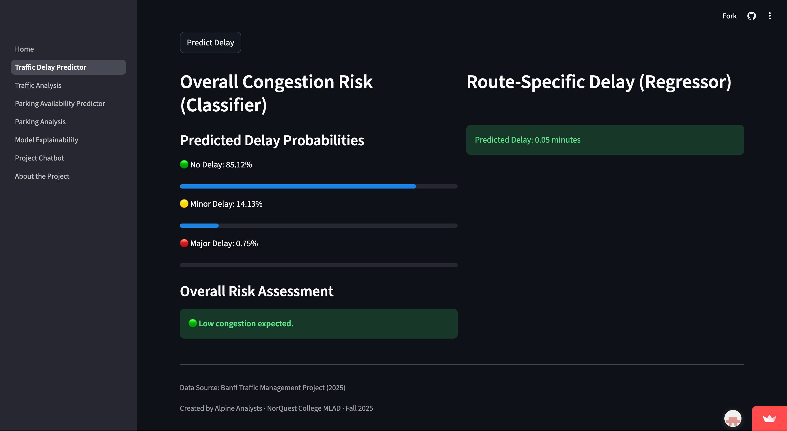
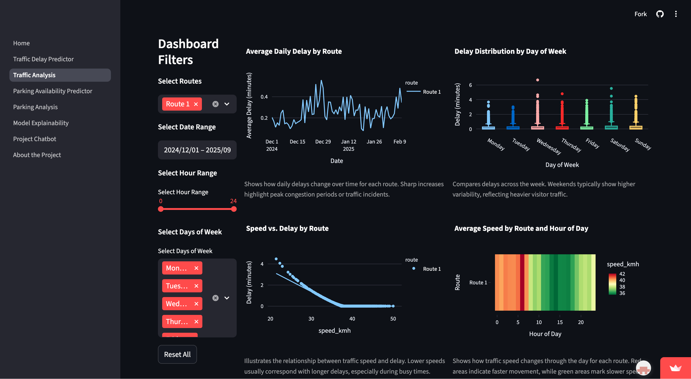
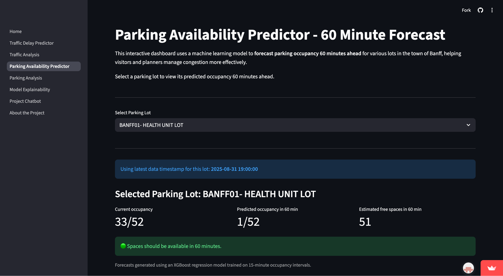
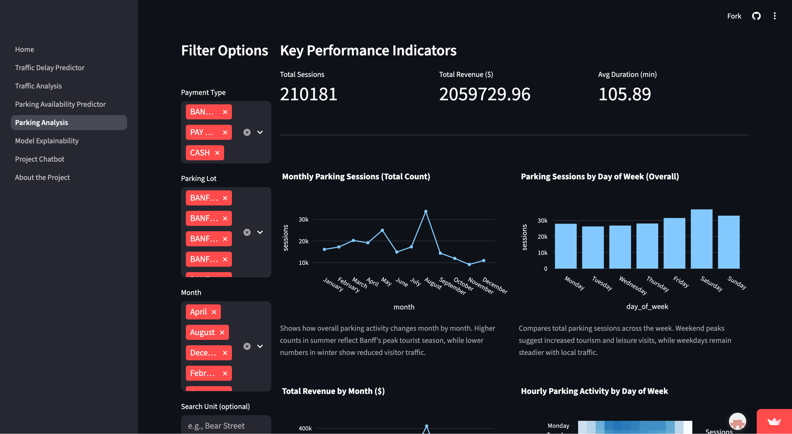
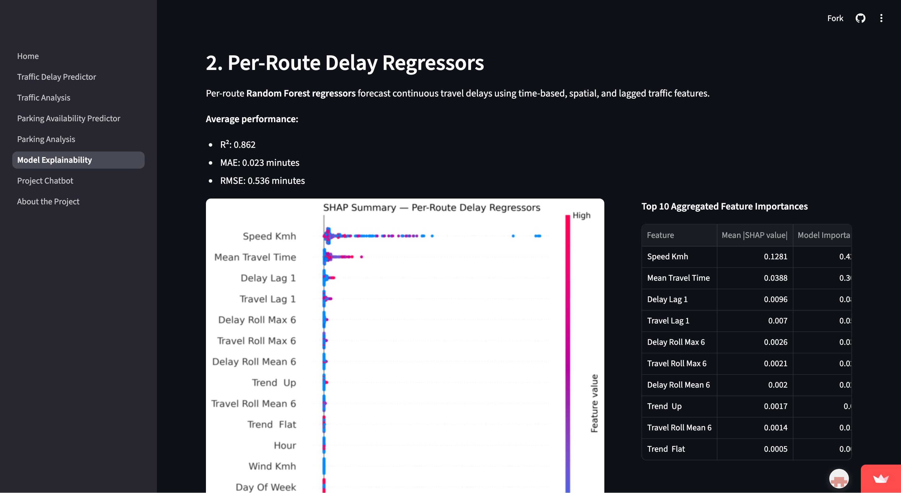
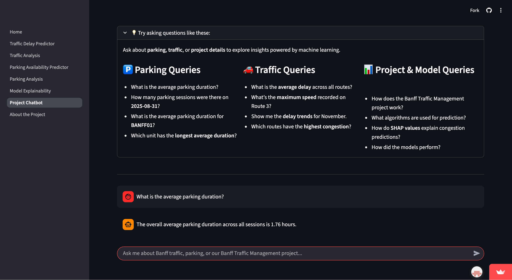

# Banff Traffic Management System

A machine learning-powered web application for analyzing and forecasting traffic congestion and parking availability across Banff National Park.

**Live App:** [banff-traffic-management.streamlit.app](https://banff-traffic-management.streamlit.app)

---

## Overview

Banff attracts millions of visitors each year. As tourism grows, so do the challenges of traffic congestion, parking scarcity, and visitor flow management. This project addresses those challenges by combining predictive modeling with interactive visualization, giving park managers and visitors a tool to monitor conditions, anticipate congestion, and make data-driven mobility decisions.

---

## Screenshots








---

## Repository Structure

```
banff-traffic-management/
├── docs/
│   ├── screenshots/                 # Application screenshots
│   ├── EDA_Final.ipynb              # Exploratory data analysis
│   ├── Routes_FE_Final.ipynb        # Route delay feature engineering
│   ├── Routes_Model_Final.ipynb     # Route delay model training and evaluation
│   ├── Parking_FE_Final.ipynb       # Parking occupancy feature engineering
│   └── Parking_Model_Final.ipynb    # Parking occupancy model training and evaluation
├── models/
│   ├── .keep
│   └── README.md                    # Model storage details
├── streamlit/
│   ├── .streamlit/                  # Streamlit config and secrets (secrets gitignored)
│   ├── assets/                      # Static assets
│   ├── pages/                       # Multi-page app pages
│   ├── utils/                       # Helper functions and data loaders
│   ├── Home.py                      # Main Streamlit entry point
│   └── requirements.txt
├── .gitignore
└── README.md
```

---

## Notebooks

| Notebook | Description |
|----------|-------------|
| `EDA_Final.ipynb` | Exploratory analysis of routes, visits, and parking datasets |
| `Routes_FE_Final.ipynb` | Feature engineering for route delay prediction including lag and rolling window features |
| `Routes_Model_Final.ipynb` | Training and evaluation of per-route Random Forest and XGBoost delay regressors |
| `Parking_FE_Final.ipynb` | Feature engineering for parking occupancy forecasting |
| `Parking_Model_Final.ipynb` | Training and evaluation of XGBoost parking occupancy model |

---

## Application Pages

**1. Traffic Delay Predictor**
Machine learning-powered model that estimates congestion probability and predicts per-route delay durations.

**2. Traffic Analysis Dashboard**
Interactive visualizations of historical speed and delay trends across Banff's main routes.

**3. Parking Availability Predictor**
Predicts parking lot occupancy 60 minutes into the future using an XGBoost regression model trained on 15-minute intervals.

**4. Parking Analysis Dashboard**
Aggregates parking session data to visualize sessions, revenue, duration, and demand by time and location.

**5. Model Explainability**
Displays SHAP-based feature importance and interpretable plots to explain which temporal, spatial, and behavioral factors most influence model predictions.

**6. Project Chatbot**
Retrieval-augmented assistant that answers questions about Banff traffic, parking analytics, and model performance in natural language.

---

## Data

| Dataset | Rows | Description |
|---------|------|-------------|
| Routes | 7,301,146 | Time-series traffic data per corridor including vehicle counts, mean travel time, and actual delay |
| Visits | 266,784 | Visitor entry/exit records used to count vehicles entering Banff per timeframe |
| Parking | 1,051,334 | Transactional parking records including date/time, payment type, amount, and lot location |

Raw data files are not committed to this repository. See `models/README.md` for access details.

---

## Machine Learning

### Traffic Delay Prediction

- **Objective:** Predict actual delay time (minutes) per route
- **Models:** XGBoost and per-route Random Forest regressors
- **Features:** Hour, month, weekend flags, route identifiers, mean travel time, rolling and lag features
- **Results:**
  - Combined XGBoost: R² = 0.976
  - Per-route Random Forest (tuned): MAE = 0.023 min, RMSE = 0.536 min, R² = 0.862
  - 35% MAE reduction over naive lag-1 baseline; 52% improvement over baseline overall

### Parking Occupancy Prediction

- **Objective:** Predict parking lot occupancy 60 minutes ahead
- **Model:** XGBoost regression
- **Features:** Lag features (lag_1 to lag_4), rolling means, hour, day of week, month, is_weekend, max_capacity, encoded unit ID
- **Results:** MAE = 0.969, R² = 0.950

---

## Technology Stack

| Category | Tools |
|----------|-------|
| Language | Python |
| Machine Learning | scikit-learn, XGBoost, LightGBM |
| Data Processing | pandas, NumPy |
| Visualization | Plotly, Folium |
| Application | Streamlit |
| Data/Model Storage | Google Drive (GCP-authenticated, private) |
| Deployment | Streamlit Community Cloud |

---

## Team Alpine Analysts

| Name | Role |
|------|------|
| **Angela Lekivetz** | Integration Lead · Streamlit Architecture & UX · Routes Data Cleaning & Feature Engineering · Route Delay Model Design |
| **Christine Joyce Moraleja** | Project Coordination & Documentation · Routes Data Cleaning & Feature Engineering · Traffic Analysis Dashboard |
| **Victoriia Biaragova** | Parking Data Cleaning & Feature Engineering · Parking Model Development |
| **Sirjana Chauhan** | Parking Data Cleaning & Feature Engineering · Parking Analysis Dashboard |

---

## Acknowledgment

Developed for **CMPT 3835 - Work Integrated Learning 2**

NorQuest College · Fall 2025

Instructors: Uchenna Mgbaja · Palwasha Afsar